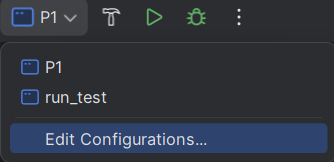
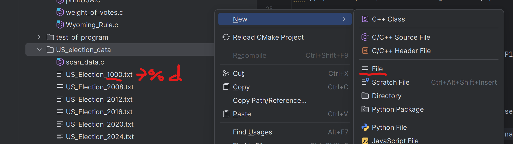
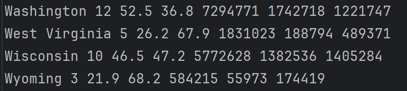
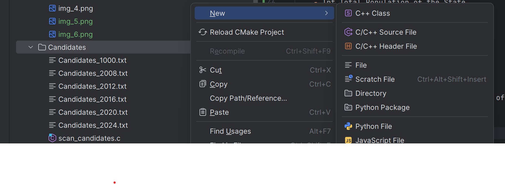
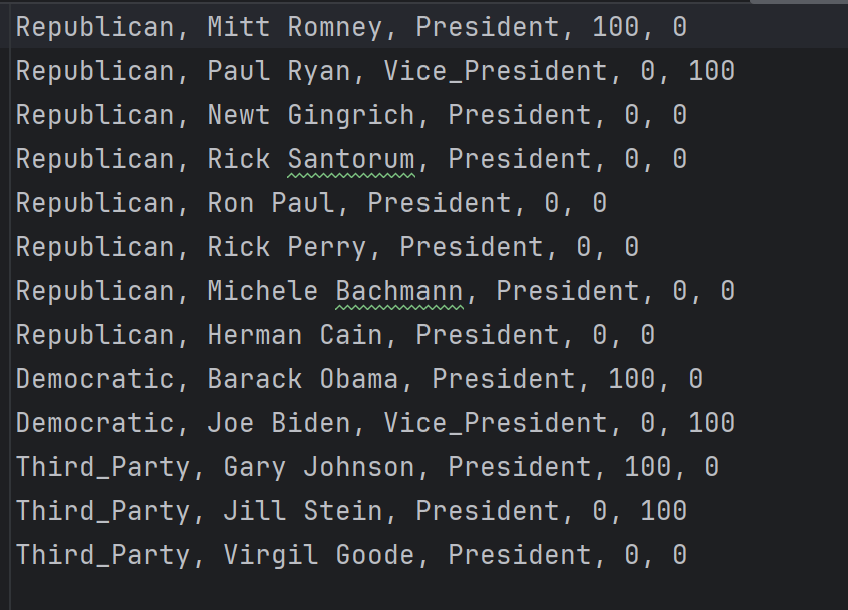
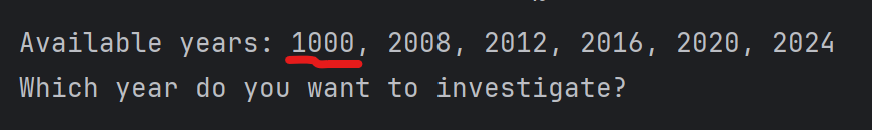

# P1 - How to use the program.
### Set op "Working directory" for "P1" and "run_test", e.g. look at the images.

1. Right click on the P1 folder

2. Chose: "Copy Path/Reference"

3. Chose: "Absolute Path"

4. Click on: "Run / Debug Configurations", then  "Edit Configurations..."

5. Apply the copied path to "Working directory" and check mark at "Run in external console". Click "Apply" then "OK"

--------------------------- Remember to do it for "P1" and "run_test" ---------------------------

### Run the program "P1".
### Follow the steps in the console.

--------------------------- How to add Custom data sets -------------------------------------------

1. Make a txt file in the folder US_election_data, named US_Election_%d.txt (%d being an integer, which may not correspond with the other file numbers)

2. Your custom data must include all 50 states including the District of Columbia, so 51 data sets in total, with each set be written on one line with the following parameters:

    - Char State Name
    - Int Electors
    - Double Democratic Voter Percentage
    - Double Republican Voter Percentage
    - Int Total Population of the State
    - Int Amount of Democratic Votes
    - Int Amount of Republican Votes
    - There must be a space between each value

An example can be seen here:

It is important to keep Wyoming at the bottom of the list, with a maximum of 3 electors and with the lowest population, to keep the uncap electors function working.

3. The exact same process needs to be done within the candidates folder, where you have to add an txt file called Candidates_%d.txt (this time the %d needs to correspond with your chosen int from the former file)

4. Lastly input the values within the candidates file which values needs to be as follows:
    - Char Party
    - Char Candidate Name
    - Char Candidacy (President, Vice_President, Both)
    - Int President Popularity (Popularity is given in a percentage from 0-100, where the 100 procent must be distributed between the presidential candidates, but must not exceed or be under a 100 total)
    - Int Vice-President Popularity (same case as president popularity)
    - There must be a "," and a space between each value

An example can be seen here:

5. Now you should be able to run the program and find your new custom data as an option like this one:

