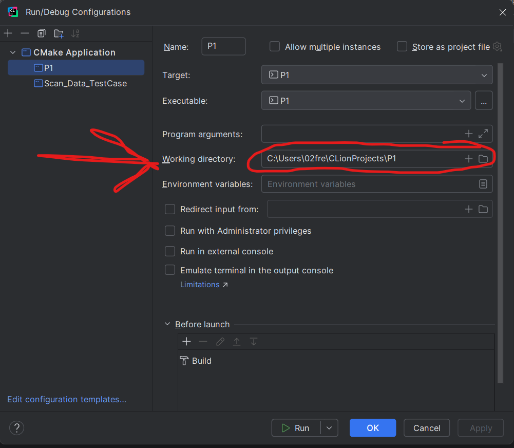

# P1 - How to use the program.
1. Set op "working directory", and find the absolute path to the program "P1", fx look at the image

!!!Remember to click "apply" then "OK"!!!

2. Run the program

3. Follow the steps in the console