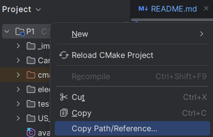
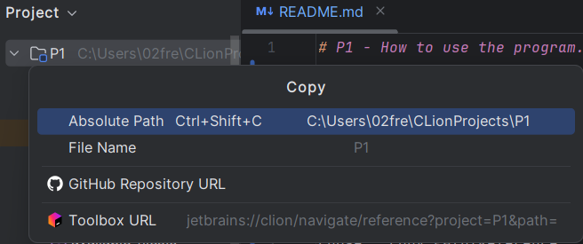
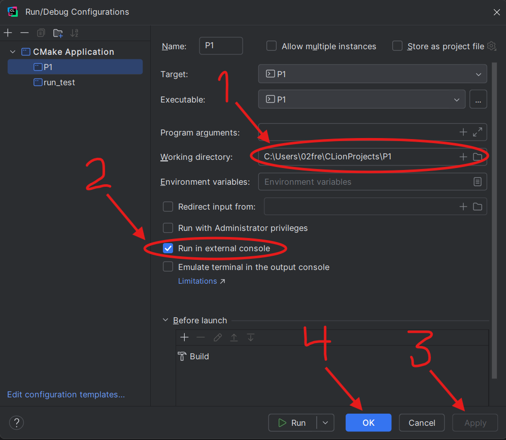

# P1 - How to use the program.
### Set op "Working directory" for "P1" and "run_test", e.g. look at the images.

1. Right click on the P1 folder

2. Chose: "Copy Path/Reference"

3. Chose: "Absolute Path"

4. Click on: "Run / Debug Configurations", then  "Edit Configurations..."

5. Apply the copied path to "Working directory", Click "Apply" then "OK"

--------------------------- Remember to do it for "P1" and "run_test" ---------------------------

### Run the program "P1".
### Follow the steps in the console.