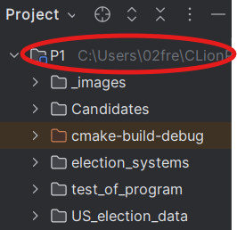

# P1 - How to use the program.
1. Set op "Working directory" for "P1" and "run_test", e.g. look at the images.

Right click on the P1 folder

Chose: "Copy Path/Reference"

Chose: "Absolute Path"

Click on: "Run / Debug Configurations", then  "Edit Configurations..."

Apply the copied path to "Working directory", Click "Apply" then "OK"

--------------------------- Remember to do it for "P1" and "run_test" ---------------------------

2. Run the program "P1".

3. Follow the steps in the console.